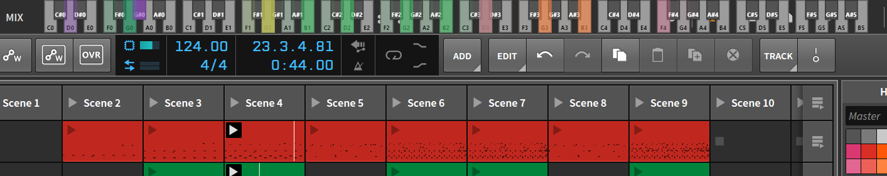

# OverWigger

## Companion App for Bitwig Studio that visualizes all notes from playing clips. 

this is a small companion app for Bitwig Studio that you can drag to any part of the screen, it stays active over Bitwig, and gives you a visual representation of the notes being played on every clip of your song.

### setup

Download the [zip](https://github.com/brunomolteni/overwigger/archive/master.zip) or clone this repo on your machine
once that's done you need to do the following:

- copy the OverWigger folder into your controllers folder, making sure to include all 3 files inside ( [here](https://www.bitwig.com/en/community/control_scripts/installation_guide) is some instructions from bitwig on how to install controller scripts )
- go into the build folder and you should unzip the version for your system ( windows 32 / 64 bits, or different builds for linux, Im working on making a OSX version available soon )
- go inside the extracted folder and you should have an .exe or equivalent for your system, which you just run, and you should get the app shown on the screen.
- you should open bitwig, and go into settings > controllers, and click the button for "add controller manually" you should see Brumo > OverWigger
- once you have bitwig running and the controller added, if you already opened the app, you can click on the tray icon to reload, or just close and re open. if the app opens and you don't see any text indicating to open bitwig, then it's set. play some clips on bitwig and that's it!

### Tools used

This project has been done using the following tools:

- preact
- primus
- fbemitter
- parcel
- express
- electron
